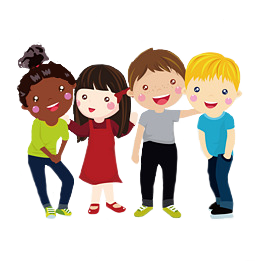

# Name: Social Student

### Slogan: Together We Can Do So Much

### Platform: Android

### Short description of the project:

Provide an application to connect students (***in Nice as a first step***) to help them be more social via meeting new friends, learning new culture and language. 
Our application facilitate creating events and inviting other students, meeting new people and try out new things. 
This application aim also to help students to publish posts to borrow, give, buy or sell something with other students.

### Implemented features:
- Authentication
- Register user information
- Events creation
- Events participating
- Events consultation
- Consulting Directory
- Consulting participants of public events

### Non Implemented features:

- Announcement Activity
- Chat functionalities

### Used frameworks:

- Firebase
- Google
- Android

### Required permissions:
- Internet
- Location
- Storage
### Authors:

- [ALIOUI Dhiaeddine](https://www.linkedin.com/in/dhiaeddine-alioui/)
- [BOUAOUN Radhwen](https://www.linkedin.com/in/radhwen-bouaoun/)
- GRITLI Amin